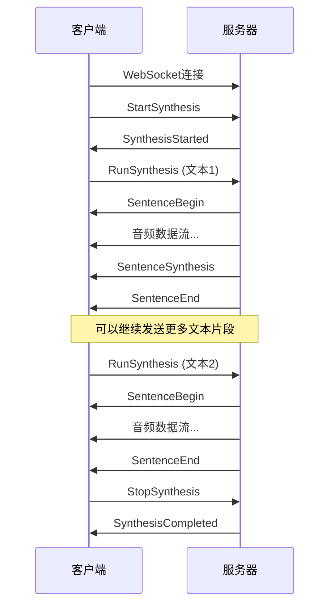
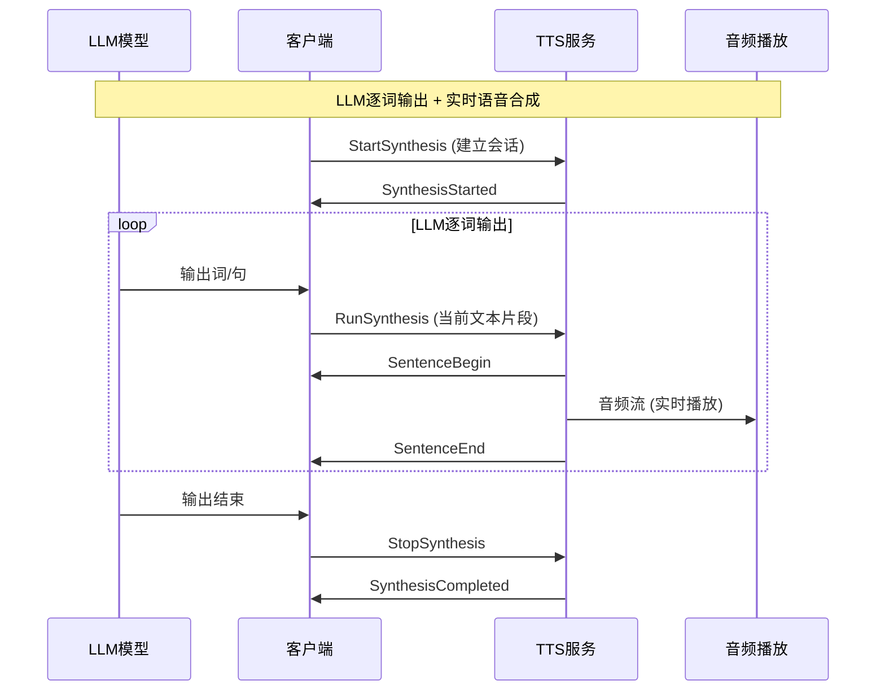

# WebSocket 流式语音合成接口

## 概述

本接口基于**阿里云流式语音合成WebSocket协议**实现，提供实时双向流式TTS服务，支持CosyVoice和CosyVoice2模型的流式合成功能。

**✨ 核心特性**：
- 🚀 **双向流模式**：支持LLM逐词输出场景，在同一连接中连续发送多个文本片段
- 🎯 **真实流式**：音频数据实时生成并推送，无需等待完整合成
- 🔄 **持续合成**：StartSynthesis → 多次RunSynthesis → StopSynthesis
- 🎪 **兼容阿里云**：完全遵循阿里云流式语音合成WebSocket协议

## 连接信息

- **WebSocket URL**: `ws://localhost:8000/ws/v1/tts`
- **协议**: WebSocket
- **消息格式**: JSON + 二进制音频流
- **测试页面**: `http://localhost:8000/ws/v1/tts/test`

## 鉴权

支持通过WebSocket Header进行可选鉴权：

```javascript
const headers = {
    'X-NLS-Token': 'your_token_here'  // 可选，如果服务端配置了APPTOKEN
};

const ws = new WebSocket('ws://localhost:8000/ws/v1/tts', [], { headers });
```

如果服务端未配置`APPTOKEN`环境变量，则鉴权为可选。

## 阿里云协议流程

### 标准流程



### 双向流模式 (LLM场景)



## 消息格式

### 1. StartSynthesis (客户端 → 服务器)

开始合成会话，设置合成参数：

```json
{
  "header": {
    "message_id": "uuid_message_id",
    "task_id": "uuid_task_id", 
    "namespace": "FlowingSpeechSynthesizer",
    "name": "StartSynthesis"
  },
  "payload": {
    "voice": "中文女",
    "format": "PCM",
    "sample_rate": 22050,
    "volume": 50,
    "speech_rate": 0,
    "pitch_rate": 0,
    "enable_subtitle": false,
    "platform": "javascript"
  }
}
```

### 2. SynthesisStarted (服务器 → 客户端)

确认合成会话已开始：

```json
{
  "header": {
    "message_id": "server_message_id",
    "task_id": "uuid_task_id",
    "namespace": "FlowingSpeechSynthesizer", 
    "name": "SynthesisStarted",
    "status": 20000000,
    "status_message": "GATEWAY|SUCCESS|Success."
  },
  "payload": {
    "session_id": "session_12345",
    "index": 1
  }
}
```

### 3. RunSynthesis (客户端 → 服务器)

发送文本片段进行合成（可多次调用）：

```json
{
  "header": {
    "message_id": "uuid_message_id",
    "task_id": "uuid_task_id",
    "namespace": "FlowingSpeechSynthesizer",
    "name": "RunSynthesis"
  },
  "payload": {
    "text": "你好，这是第一个文本片段"
  }
}
```

### 4. SentenceBegin (服务器 → 客户端)

句子合成开始：

```json
{
  "header": {
    "message_id": "server_message_id", 
    "task_id": "uuid_task_id",
    "namespace": "FlowingSpeechSynthesizer",
    "name": "SentenceBegin",
    "status": 20000000
  },
  "payload": {
    "session_id": "session_12345",
    "index": 1
  }
}
```

### 5. 音频数据流 (服务器 → 客户端)

**二进制音频数据**直接通过WebSocket发送，无JSON包装。客户端通过检查`event.data instanceof ArrayBuffer`识别。

### 6. SentenceSynthesis (服务器 → 客户端)

合成进度信息（可选）：

```json
{
  "header": {
    "message_id": "server_message_id",
    "task_id": "uuid_task_id", 
    "namespace": "FlowingSpeechSynthesizer",
    "name": "SentenceSynthesis",
    "status": 20000000
  },
  "payload": {
    "subtitles": [
      {
        "text": "你好，这是第一个文本片段",
        "begin_time": 0,
        "end_time": 2000,
        "begin_index": 0,
        "end_index": 12,
        "sentence": true,
        "phoneme_list": []
      }
    ]
  }
}
```

### 7. SentenceEnd (服务器 → 客户端)

句子合成结束，可以继续发送新的RunSynthesis：

```json
{
  "header": {
    "message_id": "server_message_id",
    "task_id": "uuid_task_id",
    "namespace": "FlowingSpeechSynthesizer", 
    "name": "SentenceEnd",
    "status": 20000000
  },
  "payload": {
    "subtitles": [...]
  }
}
```

### 8. StopSynthesis (客户端 → 服务器)

结束合成会话：

```json
{
  "header": {
    "message_id": "uuid_message_id",
    "task_id": "uuid_task_id",
    "namespace": "FlowingSpeechSynthesizer",
    "name": "StopSynthesis"
  }
}
```

### 9. SynthesisCompleted (服务器 → 客户端)

合成会话完成：

```json
{
  "header": {
    "message_id": "server_message_id",
    "task_id": "uuid_task_id",
    "namespace": "FlowingSpeechSynthesizer",
    "name": "SynthesisCompleted", 
    "status": 20000000
  },
  "payload": {
    "session_id": "session_12345",
    "index": 1
  }
}
```

### 10. TaskFailed (服务器 → 客户端)

任务失败：

```json
{
  "header": {
    "namespace": "Default",
    "name": "TaskFailed",
    "status": 40000000,
    "message_id": "server_message_id",
    "task_id": "uuid_task_id", 
    "status_text": "错误原因描述"
  }
}
```

## 参数说明

### StartSynthesis参数

| 参数 | 类型 | 必需 | 默认值 | 说明 |
|------|------|------|--------|------|
| voice | string | 否 | "中文女" | 音色名称，支持预设和克隆音色 |
| format | string | 否 | "PCM" | 音频格式：PCM/WAV/MP3 |
| sample_rate | integer | 否 | 22050 | 采样率：8000/16000/22050/24000 |
| volume | integer | 否 | 50 | 音量：0-100 |
| speech_rate | integer | 否 | 0 | 语速：-500到500 |
| pitch_rate | integer | 否 | 0 | 音调：-500到500 |
| enable_subtitle | boolean | 否 | false | 是否启用字幕 |

### 状态码

| 状态码 | 说明 |
|--------|------|
| 20000000 | 成功 |
| 40000000 | 客户端错误 |
| 50000000 | 服务器错误 |

## 音色支持

### 预设音色
- **CosyVoice模型**：中文女、中文男、英文女、英文男、日语男、韩语女、粤语女等
- **支持流式**：使用`stream=True`功能进行实时合成

### 克隆音色  
- **CosyVoice2模型**：支持预先训练的克隆音色
- **零样本合成**：使用保存的音色ID进行流式合成

### 获取音色列表
```bash
curl http://localhost:8000/stream/v1/tts/voices
```

## 客户端示例

### JavaScript 双向流客户端

```html
<!DOCTYPE html>
<html>
<head>
    <title>双向流式TTS测试</title>
</head>
<body>
    <div>
        <input type="text" id="textInput" placeholder="输入文本片段">
        <button onclick="connectAndStart()">连接并开始</button>
        <button onclick="sendText()">发送文本</button>
        <button onclick="stopSynthesis()">停止合成</button>
    </div>
    <audio id="audioPlayer" controls></audio>
    
    <script>
        let websocket = null;
        let taskId = null;
        let audioChunks = [];
        
        function generateUUID() {
            return 'xxxxxxxx-xxxx-4xxx-yxxx-xxxxxxxxxxxx'.replace(/[xy]/g, function(c) {
                const r = Math.random() * 16 | 0;
                const v = c == 'x' ? r : (r & 0x3 | 0x8);
                return v.toString(16);
            }).replace(/-/g, '').substring(0, 32);
        }
        
        async function connectAndStart() {
            websocket = new WebSocket('ws://localhost:8000/ws/v1/tts');
            websocket.binaryType = 'arraybuffer';
            taskId = generateUUID();
            audioChunks = [];
            
            websocket.onopen = async () => {
                console.log('WebSocket连接成功');
                
                // 发送StartSynthesis
                const startMessage = {
                    header: {
                        message_id: generateUUID(),
                        task_id: taskId,
                        namespace: 'FlowingSpeechSynthesizer',
                        name: 'StartSynthesis'
                    },
                    payload: {
                        voice: '中文女',
                        format: 'PCM',
                        sample_rate: 22050,
                        volume: 50,
                        speech_rate: 0
                    }
                };
                
                websocket.send(JSON.stringify(startMessage));
            };
            
            websocket.onmessage = async (event) => {
                if (event.data instanceof ArrayBuffer) {
                    // 音频数据
                    const audioChunk = new Uint8Array(event.data);
                    audioChunks.push(audioChunk);
                    console.log(`收到音频数据块: ${audioChunk.length} 字节`);
                } else {
                    // JSON消息
                    const response = JSON.parse(event.data);
                    console.log('收到消息:', response.header.name);
                    
                    if (response.header.name === 'SynthesisStarted') {
                        console.log('✅ 合成会话已开始，可以发送文本片段');
                    } else if (response.header.name === 'SentenceEnd') {
                        console.log('✅ 句子合成完成，可以继续发送新文本');
                    } else if (response.header.name === 'SynthesisCompleted') {
                        console.log('🎉 合成完成！');
                        playAudio();
                    }
                }
            };
        }
        
        function sendText() {
            const text = document.getElementById('textInput').value;
            if (!text || !websocket) return;
            
            const runMessage = {
                header: {
                    message_id: generateUUID(),
                    task_id: taskId,
                    namespace: 'FlowingSpeechSynthesizer',
                    name: 'RunSynthesis'
                },
                payload: {
                    text: text
                }
            };
            
            websocket.send(JSON.stringify(runMessage));
            document.getElementById('textInput').value = '';
            console.log(`发送文本: ${text}`);
        }
        
        function stopSynthesis() {
            if (!websocket) return;
            
            const stopMessage = {
                header: {
                    message_id: generateUUID(),
                    task_id: taskId,
                    namespace: 'FlowingSpeechSynthesizer',
                    name: 'StopSynthesis'
                }
            };
            
            websocket.send(JSON.stringify(stopMessage));
        }
        
        function playAudio() {
            if (audioChunks.length === 0) return;
            
            // 合并PCM数据并转换为WAV
            const totalLength = audioChunks.reduce((sum, chunk) => sum + chunk.length, 0);
            const combinedAudio = new Uint8Array(totalLength);
            
            let offset = 0;
            for (const chunk of audioChunks) {
                combinedAudio.set(chunk, offset);
                offset += chunk.length;
            }
            
            // 转换为WAV格式
            const wavData = pcmToWav(combinedAudio, 22050);
            const blob = new Blob([wavData], { type: 'audio/wav' });
            const audioUrl = URL.createObjectURL(blob);
            
            document.getElementById('audioPlayer').src = audioUrl;
        }
        
        function pcmToWav(pcmData, sampleRate) {
            const channels = 1;
            const bitsPerSample = 16;
            const byteRate = sampleRate * channels * bitsPerSample / 8;
            const blockAlign = channels * bitsPerSample / 8;
            const dataSize = pcmData.length;
            const fileSize = 36 + dataSize;
            
            const buffer = new ArrayBuffer(44 + dataSize);
            const view = new DataView(buffer);
            
            // WAV文件头
            const writeString = (offset, string) => {
                for (let i = 0; i < string.length; i++) {
                    view.setUint8(offset + i, string.charCodeAt(i));
                }
            };
            
            writeString(0, 'RIFF');
            view.setUint32(4, fileSize, true);
            writeString(8, 'WAVE');
            writeString(12, 'fmt ');
            view.setUint32(16, 16, true);
            view.setUint16(20, 1, true);
            view.setUint16(22, channels, true);
            view.setUint32(24, sampleRate, true);
            view.setUint32(28, byteRate, true);
            view.setUint16(32, blockAlign, true);
            view.setUint16(34, bitsPerSample, true);
            writeString(36, 'data');
            view.setUint32(40, dataSize, true);
            
            // 拷贝PCM数据
            const pcmView = new Uint8Array(buffer, 44);
            pcmView.set(pcmData);
            
            return buffer;
        }
        
        // 回车发送
        document.getElementById('textInput').addEventListener('keypress', function(e) {
            if (e.key === 'Enter') {
                sendText();
            }
        });
    </script>
</body>
</html>
```

### Python 双向流客户端

```python
#!/usr/bin/env python3
import asyncio
import json
import websockets
import uuid
import struct

class AliyunBidirectionalTTSClient:
    def __init__(self, ws_url="ws://localhost:8000/ws/v1/tts"):
        self.ws_url = ws_url
        self.websocket = None
        self.task_id = None
        self.audio_data = b''
        
    def generate_uuid(self):
        return str(uuid.uuid4()).replace('-', '')[:32]
    
    async def connect_and_start(self, voice="中文女"):
        """建立连接并开始合成会话"""
        self.websocket = await websockets.connect(self.ws_url)
        self.task_id = self.generate_uuid()
        self.audio_data = b''
        
        # 发送StartSynthesis
        start_message = {
            "header": {
                "message_id": self.generate_uuid(),
                "task_id": self.task_id,
                "namespace": "FlowingSpeechSynthesizer",
                "name": "StartSynthesis"
            },
            "payload": {
                "voice": voice,
                "format": "PCM", 
                "sample_rate": 22050,
                "volume": 50,
                "speech_rate": 0
            }
        }
        
        await self.websocket.send(json.dumps(start_message))
        print("✅ 发送StartSynthesis")
        
        # 等待SynthesisStarted
        response = await self.websocket.recv()
        data = json.loads(response)
        
        if data["header"]["name"] == "SynthesisStarted":
            print("✅ 合成会话已开始")
            return True
        else:
            print(f"❌ 启动失败: {data}")
            return False
    
    async def send_text(self, text):
        """发送文本片段"""
        if not self.websocket:
            print("❌ 未连接")
            return
            
        run_message = {
            "header": {
                "message_id": self.generate_uuid(),
                "task_id": self.task_id,
                "namespace": "FlowingSpeechSynthesizer",
                "name": "RunSynthesis"
            },
            "payload": {
                "text": text
            }
        }
        
        await self.websocket.send(json.dumps(run_message))
        print(f"→ 发送文本: {text}")
        
        # 接收响应和音频数据
        await self._receive_until_sentence_end()
    
    async def _receive_until_sentence_end(self):
        """接收消息直到句子结束"""
        while True:
            response = await self.websocket.recv()
            
            if isinstance(response, bytes):
                # 音频数据
                self.audio_data += response
                print(f"♪ 收到音频数据: {len(response)} 字节")
            else:
                # JSON消息
                data = json.loads(response)
                name = data["header"]["name"]
                print(f"← {name}")
                
                if name == "SentenceEnd":
                    print("✅ 句子合成完成\n")
                    break
                elif name == "TaskFailed":
                    print(f"❌ 任务失败: {data['header'].get('status_text')}")
                    break
    
    async def stop_synthesis(self):
        """停止合成会话"""
        stop_message = {
            "header": {
                "message_id": self.generate_uuid(),
                "task_id": self.task_id,
                "namespace": "FlowingSpeechSynthesizer",
                "name": "StopSynthesis"
            }
        }
        
        await self.websocket.send(json.dumps(stop_message))
        print("→ 发送StopSynthesis")
        
        # 等待SynthesisCompleted
        while True:
            response = await self.websocket.recv()
            
            if isinstance(response, bytes):
                self.audio_data += response
                continue
                
            data = json.loads(response)
            if data["header"]["name"] == "SynthesisCompleted":
                print("🎉 合成完成！")
                break
        
        await self.websocket.close()
    
    def save_audio(self, filename="output.wav"):
        """保存音频为WAV文件"""
        if not self.audio_data:
            print("❌ 没有音频数据")
            return
            
        # PCM转WAV
        sample_rate = 22050
        channels = 1
        bits_per_sample = 16
        byte_rate = sample_rate * channels * bits_per_sample // 8
        block_align = channels * bits_per_sample // 8
        data_size = len(self.audio_data)
        file_size = 36 + data_size
        
        with open(filename, 'wb') as f:
            # WAV文件头
            f.write(b'RIFF')
            f.write(struct.pack('<L', file_size))
            f.write(b'WAVE')
            f.write(b'fmt ')
            f.write(struct.pack('<L', 16))
            f.write(struct.pack('<H', 1))
            f.write(struct.pack('<H', channels))
            f.write(struct.pack('<L', sample_rate))
            f.write(struct.pack('<L', byte_rate))
            f.write(struct.pack('<H', block_align))
            f.write(struct.pack('<H', bits_per_sample))
            f.write(b'data')
            f.write(struct.pack('<L', data_size))
            f.write(self.audio_data)
        
        print(f"💾 音频已保存: {filename}")

# 交互式测试
async def interactive_test():
    client = AliyunBidirectionalTTSClient()
    
    # 连接并开始会话
    if not await client.connect_and_start():
        return
    
    print("\n🎯 进入交互模式，输入文本片段（输入'quit'退出）:")
    
    try:
        while True:
            text = input("\n> ")
            if text.lower() in ['quit', 'exit', 'q']:
                break
                
            if text.strip():
                await client.send_text(text)
        
        # 停止合成
        await client.stop_synthesis()
        
        # 保存音频
        client.save_audio()
        
    except KeyboardInterrupt:
        print("\n用户中断")
        await client.stop_synthesis()

# 运行测试
if __name__ == "__main__":
    asyncio.run(interactive_test())
```

## 测试工具

### 1. 内置Web测试页面

访问 `http://localhost:8000/ws/v1/tts/test` 体验完整的双向流式合成功能：

- 🔗 建立WebSocket连接
- 📝 连续发送多个文本片段  
- 🎵 实时音频播放
- 📊 统计信息展示
- ⌨️ 回车键快捷发送

### 2. Python测试脚本

```bash
# 交互式双向流测试
python tests/test_aliyun_websocket.py

# 指定参数测试  
python tests/test_aliyun_websocket.py --voice "中文女" --format PCM --sample-rate 22050
```

### 3. 获取音色列表

```bash
curl http://localhost:8000/stream/v1/tts/voices
```

## LLM集成示例

### 与OpenAI兼容

```python
import openai
import asyncio
from aliyun_bidirectional_tts import AliyunBidirectionalTTSClient

async def llm_with_tts():
    # 初始化TTS客户端
    tts_client = AliyunBidirectionalTTSClient()
    await tts_client.connect_and_start()
    
    # 初始化OpenAI客户端
    client = openai.OpenAI()
    
    # 流式生成文本
    stream = client.chat.completions.create(
        model="gpt-3.5-turbo",
        messages=[{"role": "user", "content": "讲一个有趣的故事"}],
        stream=True
    )
    
    buffer = ""
    for chunk in stream:
        if chunk.choices[0].delta.content:
            buffer += chunk.choices[0].delta.content
            
            # 当遇到句号、问号、感叹号时发送TTS
            if any(punct in buffer for punct in ['。', '！', '？', '.', '!', '?']):
                await tts_client.send_text(buffer.strip())
                buffer = ""
    
    # 发送剩余内容
    if buffer.strip():
        await tts_client.send_text(buffer.strip())
    
    # 结束合成
    await tts_client.stop_synthesis()
    tts_client.save_audio("llm_story.wav")

asyncio.run(llm_with_tts())
```

## 性能优化

### 流式特性
- ✅ **真实流式**：基于CosyVoice/CosyVoice2的`stream=True`功能
- ✅ **低延迟**：音频数据实时生成，无需等待完整合成
- ✅ **内存友好**：流式传输，避免大音频文件缓存

### 音频处理
- ✅ **二进制传输**：音频数据直接以二进制格式传输，无Base64编码开销
- ✅ **格式支持**：PCM/WAV/MP3等多种格式
- ✅ **自动采样率**：根据模型自动选择最佳采样率

### 连接管理
- ✅ **连接复用**：单一WebSocket连接处理多个文本片段
- ✅ **状态管理**：严格的状态机管理，确保协议正确性
- ✅ **错误处理**：完善的异常处理和恢复机制

## 错误处理

### 常见错误

| 错误类型 | 状态码 | 解决方案 |
|----------|--------|----------|
| 连接失败 | - | 检查服务是否运行在正确端口 |
| 认证失败 | 40100005 | 检查X-NLS-Token头部 |  
| 参数无效 | 40000001 | 检查StartSynthesis参数格式 |
| 任务ID不匹配 | - | 确保所有消息使用相同task_id |
| 状态错误 | - | 按正确顺序发送协议消息 |
| 音色不存在 | - | 检查音色名称或刷新音色列表 |

### 调试技巧

1. **启用详细日志**:
```bash
export LOG_LEVEL=DEBUG  
python -m uvicorn app.main:app --log-level debug
```

2. **监控WebSocket消息**:
```javascript
websocket.onmessage = (event) => {
    if (event.data instanceof ArrayBuffer) {
        console.log('音频数据:', event.data.byteLength, '字节');
    } else {
        console.log('JSON消息:', JSON.parse(event.data));
    }
};
```

3. **检查连接状态**:
```python
print(f"连接状态: {websocket.state}")  
print(f"任务ID: {task_id}")
```

## 技术实现细节

### CosyVoice流式支持
- **预设音色**: 使用CosyVoice1的`stream=True`功能
- **克隆音色**: 使用CosyVoice2的`stream=True`功能  
- **采样率**: CosyVoice(22050Hz), CosyVoice2(24000Hz)

### 音频数据格式
- **PCM**: 16位有符号整数，小端字节序
- **WAV**: 标准WAV格式，包含文件头
- **实时传输**: 音频块大小动态调整，平衡延迟和性能

### 协议兼容性
- **完全兼容**: 严格遵循阿里云流式语音合成协议
- **扩展支持**: 支持本地音色和克隆音色
- **向后兼容**: 支持传统单次合成模式

---

## 相关链接

- **阿里云官方协议**: [流式语音合成WebSocket协议](https://help.aliyun.com/zh/isi/developer-reference/websocket-protocol-description)
- **CosyVoice模型**: [CosyVoice GitHub](https://github.com/FunAudioLLM/CosyVoice)
- **在线测试**: `http://localhost:8000/ws/v1/tts/test`